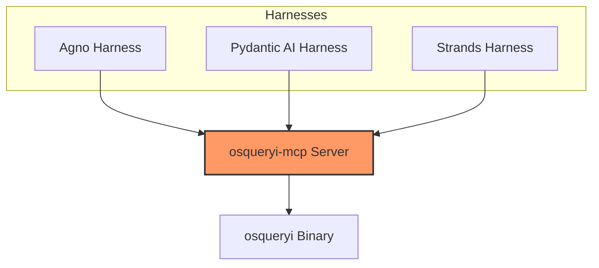
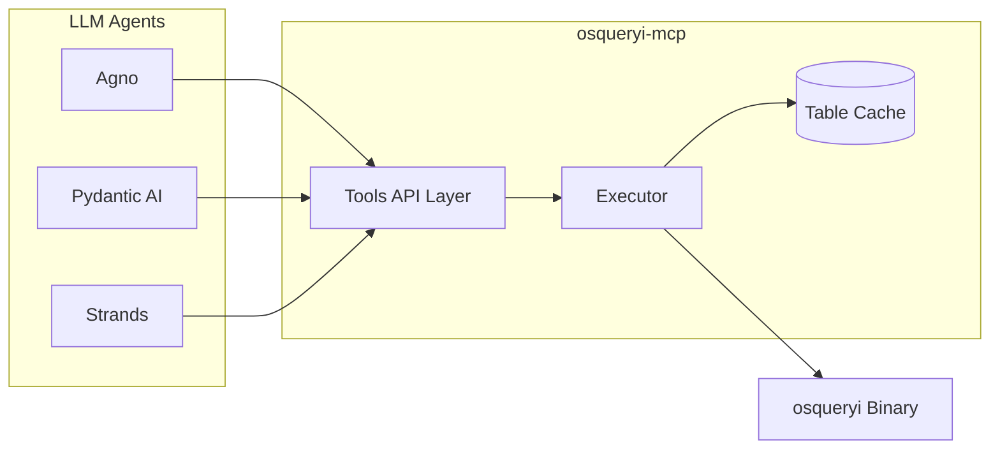
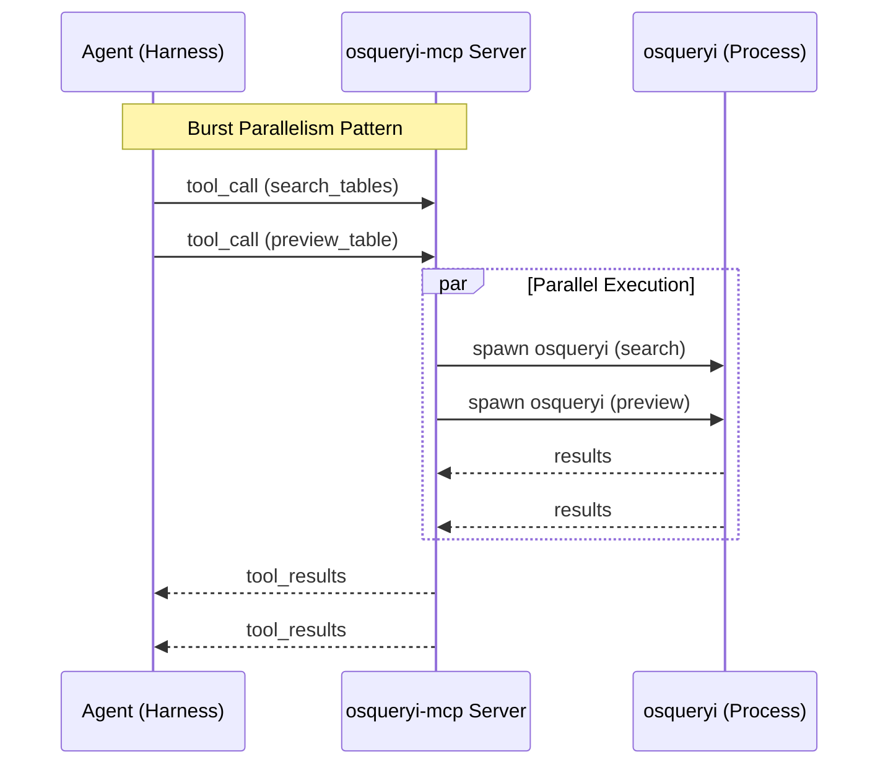
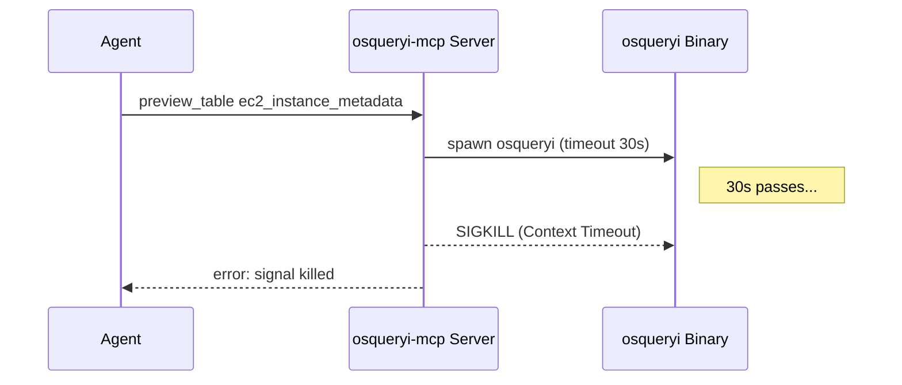

# Ground Truth: osqueryi-mcp Investigation

This document summarizes what is directly supported by the current logs for the `osqueryi-mcp` server and three agent harnesses (**Agno**, **Pydantic AI**, and **Strands**) collected on May 10, 2026.

## 1. Test Scope

- **This is a repeated experiment set, not a single triplet of runs.** The logs span roughly `10:55 EDT` through `13:14 EDT`, include many server restarts, and cover multiple prompt/model variants.
- **Shared workloads observed:** structured discovery, single-table investigation (`processes` via `preview_table` + `query_table`), and join-heavy work (`run_query` over `processes`, `users`, and `listening_ports`).
- **Prompt alignment is partial, not identical:**
    - **Pydantic AI** and **Strands** share the "find account-related tables efficiently" discovery prompt (`pydantic_ai_test.log:7`, `strands_test.log:79-114`). The `TASKS` tuples in `tools/pydantic_ai_test_mcp.py:103-128` and `tools/strands_test_mcp.py:206-231` are byte-for-byte identical.
    - **Agno** uses a related but different prompt focused on comparing helper tools with the legacy flow and explicitly searching `uid` with `search_columns=true` (`agno_test.log:9-13`, `agno_test.log:1769-1774`, `tools/agno_test_mcp.py:253-282`).
- **Framework "differences" are mostly harness-level**, not server-level: each harness wires the same MCP server to a model via a different client library (Agno's `MCPTools`, Pydantic AI's `MCPServerStdio`, Strands' `MCPClient`), with different hook APIs and teardown semantics. The server (`cmd/osqueryi-mcp/`) is identical across all three.
- **LLM backends observed by framework across the full logs:**
    - **Agno** — `gemini-3.1-flash-lite`, `gemini-3.1-flash-lite-preview`, `gemini-3-flash-preview`, `gemini-3.1-pro-preview`, and later `claude-haiku-4-5` (`agno_test.log:2`, `agno_test.log:418`, `agno_test.log:838`, `agno_test.log:1296`, `agno_test.log:1762`).
    - **Pydantic AI** — `claude-haiku-4-5`, `gemini-3.1-flash-lite`, `gemini-3.1-pro-preview`, and `gemini-3.1-flash-lite-preview` (`pydantic_ai_test.log:2`, `pydantic_ai_test.log:405`, `pydantic_ai_test.log:875`, `pydantic_ai_test.log:1142`).
    - **Strands** — initially `claude-haiku-4-5`, later `gpt-5-mini` (`strands_test.log:1`, `strands_test.log:16535`).
- **Server revisions observed:** early runs are on commit `ed82c5f`, later runs on `0f523a9` (`osqueryi-mcp.log:2`, `osqueryi-mcp.log:110`).

## 2. MCP Server Architecture (`osqueryi-mcp`)

- **Bridge Type:** Connects LLM agents to the `osqueryi` binary.
- **Exposed Tools (7):**
    - `search_tables`, `preview_table`, `query_table`, `run_query`, `list_tables`, `describe_table`, `refresh_cache`.
- **Cache:** Maintains a warmed cache of **155 osquery tables**.
- **Performance Benchmarks (observed in `osqueryi-mcp.log`):**
    - **Metadata Discovery (`search_tables`, `list_tables`):** usually **0ms-7ms**. Plain cache hits are commonly 0ms, but `search_columns=true` searches and some later searches took 3ms-10ms (`osqueryi-mcp.log:82`, `osqueryi-mcp.log:184`, `osqueryi-mcp.log:1017-1035`).
    - **Table/Data Acquisition (`preview_table`, `query_table`, `run_query`):** typically **~50ms-398ms** depending on table, payload size, and query complexity. Observed examples range from `preview_table users` at 51ms/76ms to `run_query` at 398ms (`osqueryi-mcp.log:258`, `osqueryi-mcp.log:923`, `osqueryi-mcp.log:839`).
    - **Timeouts:** A real timeout was observed later: `preview_table ec2_instance_metadata` ran for **30032ms** and ended with `signal: killed` (`osqueryi-mcp.log:1018-1019`). This is the `Config.Timeout: 30 * time.Second` default (`cmd/osqueryi-mcp/main.go:35`) being enforced by `context.WithTimeout` inside `runSQL` (`cmd/osqueryi-mcp/executor.go:122-148`), which causes Go to SIGKILL the child `osqueryi`. Tunable via `OSQUERYI_TIMEOUT`.
- **Query Semantics:** `search_tables` behaves like literal substring matching. A compound query such as `"processes users"` returned no matches (`osqueryi-mcp.log:21-22`), and later tool descriptions were updated to recommend single-word queries. Confirmed in `executor.go:560`: a single `strings.Contains(strings.ToLower(table), query)` against the already-lowercased query — no tokenization.
- **Response Size Limits:** Data-returning tools (`run_query`, `query_table`, `preview_table`) cap output at `MaxPayloadSize = 16384` bytes and `MaxRows = 100` (`executor.go:422-425`). `run_query` / `query_table` go through `truncateJSON` (lines 433-480); `preview_table` runs its own halving loop (lines 633-642). Some verbosity attributed to specific models in §4 may actually be reactions to truncation messages embedded in the JSON response.

## 3. Agent Implementation Comparison
...
...
## 5. Cross-Log Mapping & Correlation

Correlation between `osqueryi-mcp.log` and client logs reveals three distinct interaction patterns:

1.  **Burst Parallelism (Pydantic AI/Strands, and later Agno):** Multiple tool calls often hit the server in the same millisecond. Server handles these concurrently with independent `osqueryi` spawns.
2.  **Variable Agno Cadence:** Early Agno runs show multi-turn conversational delay with one call/result pair at a time; later runs fan out searches and previews in batches. The framework is not purely sequential or purely parallel across the full log set.
3.  **Resource Contention:** *No PID-lock contention is observable in these logs — and it is structurally impossible in this dataset.* All three Python harnesses explicitly disable the lock at startup with `os.environ.setdefault("OSQUERYI_LOCKFILE", "off")` (`tools/agno_test_mcp.py:287`, `tools/pydantic_ai_test_mcp.py:148`, `tools/strands_test_mcp.py:251`), and `acquireLock` short-circuits when the path is `"off"` (`cmd/osqueryi-mcp/main.go:66-68`). The "failed to acquire lock" claim can't be validated without changing the harnesses to leave `OSQUERYI_LOCKFILE` at its default.

## 6. Security & Permission Observations
- **Process Visibility:** `listening_ports` rows with `pid: -1` appear and are filtered out by agents via `WHERE lp.pid != -1 AND lp.port > 0` (`osqueryi-mcp.log:71-75`). Consistent with the server running without root / outside a privileged namespace.
- **Network Discovery:** Agents inspected `listening_ports` and `processes`, identifying many Unix Domain Socket entries (`port 0`) plus a smaller set of non-zero listeners. Later runs corroborate listeners on `68/UDP`, `6379/TCP` (localhost), `41641/UDP`, and `52739/TCP` (`osqueryi-mcp.log:37-42`, `strands_test.log:16540-16584`). `tailscaled` appears in process data and `6379` strongly suggests Redis on localhost, but the logs still do **not** directly map those listeners to owning PIDs inside `listening_ports`.

## 7. Identified Issues

- **Strands Framework:** Frequent `RuntimeError: Event loop is closed` at shutdown (`strands_test.log:539,541,606-607`) and repeated `POST /v1/messages/count_tokens HTTP/1.1 400 Bad Request` against the Anthropic API (`strands_test.log:204,209,218`).
- **`ec2_instance_metadata` Timeout (observed):** A later run did invoke `preview_table ec2_instance_metadata`, and it hit the server's 30s timeout path (`osqueryi-mcp.log:1018-1019`). The earlier claim that this was untested is no longer correct.
- **Schema / Query Drift (tool-surface issue, not just model behavior):** One later `run_query` failed with `no such column: pl.local_address` (`osqueryi-mcp.log:971`). The structural cause is that `run_query` (`cmd/osqueryi-mcp/tools.go:83-123`) forwards SQL straight to `runSQL` with no validation — only `query_table` validates columns, `where`, and `order_by` against the cached schema (`cmd/osqueryi-mcp/executor.go:647-667`). Mitigations are tool-side, not model-side: tighten the system prompts in the harnesses to forbid `run_query` for single-table work, or add a pre-flight schema check inside `run_query` itself.
- **Server Lock (untested by design):** No "failed to acquire lock" or PID-file errors appear in `osqueryi-mcp.log` because the harnesses turn the lock off (see §5 item 3). To validate the lock path, remove the `OSQUERYI_LOCKFILE=off` lines and run two harnesses against the default lock file simultaneously.
