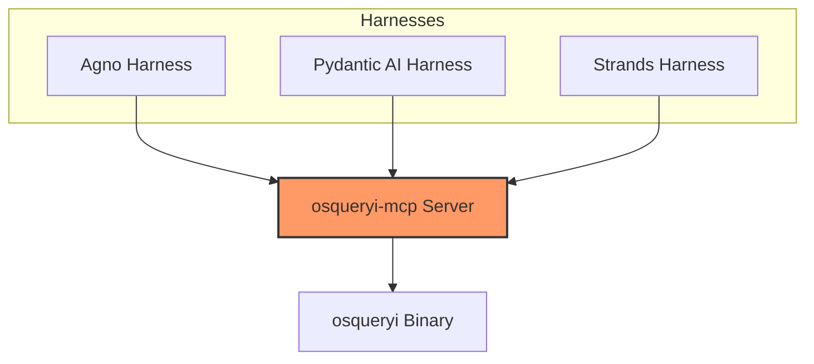
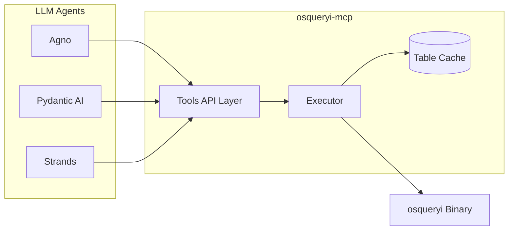
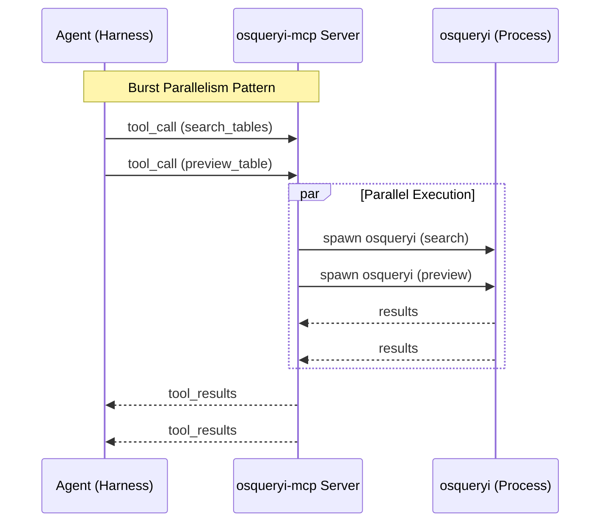
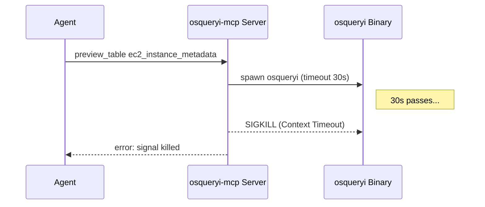

# Ground Truth: osqueryi-mcp Investigation

This document summarizes what is directly supported by the current logs for the `osqueryi-mcp` server and three agent harnesses (**Agno**, **Pydantic AI**, and **Strands**) collected on May 10, 2026.

## Test Scope

- **This is a repeated experiment set, not a single triplet of runs.** The logs span roughly `10:55 EDT` through `13:14 EDT`, include many server restarts, and cover multiple prompt/model variants.
- **Shared workloads observed:** structured discovery, single-table investigation (`processes` via `preview_table` + `query_table`), and join-heavy work (`run_query` over `processes`, `users`, and `listening_ports`).
- **Prompt alignment is partial, not identical:**
    - **Pydantic AI** and **Strands** share the "find account-related tables efficiently" discovery prompt (`pydantic_ai_test.log:7`, `strands_test.log:79-114`). The `TASKS` tuples in `tools/pydantic_ai_test_mcp.py:103-128` and `tools/strands_test_mcp.py:206-231` are byte-for-byte identical.
    - **Agno** uses a related but different prompt focused on comparing helper tools with the legacy flow and explicitly searching `uid` with `search_columns=true` (`agno_test.log:9-13`, `agno_test.log:1769-1774`, `tools/agno_test_mcp.py:253-282`).
- **Framework "differences" are mostly harness-level**, not server-level: each harness wires the same MCP server to a model via a different client library (Agno's `MCPTools`, Pydantic AI's `MCPServerStdio`, Strands' `MCPClient`), with different hook APIs and teardown semantics. The server (`cmd/osqueryi-mcp/`) is identical across all three.
- **LLM backends observed by framework across the full logs:**
    - **Agno** — `gemini-3.1-flash-lite`, `gemini-3.1-flash-lite-preview`, `gemini-3-flash-preview`, `gemini-3.1-pro-preview`, and later `claude-haiku-4-5` (`agno_test.log:2`, `agno_test.log:418`, `agno_test.log:838`, `agno_test.log:1296`, `agno_test.log:1762`).
    - **Pydantic AI** — `claude-haiku-4-5`, `gemini-3.1-flash-lite`, `gemini-3.1-pro-preview`, and `gemini-3.1-flash-lite-preview` (`pydantic_ai_test.log:2`, `pydantic_ai_test.log:405`, `pydantic_ai_test.log:875`, `pydantic_ai_test.log:1142`).
    - **Strands** — initially `claude-haiku-4-5`, later `gpt-5-mini` (`strands_test.log:1`, `strands_test.log:16535`).
- **Server revisions observed:** early runs are on commit `ed82c5f`, later runs on `0f523a9` (`osqueryi-mcp.log:2`, `osqueryi-mcp.log:110`).

## MCP Server Architecture (`osqueryi-mcp`)

- **Bridge Type:** Connects LLM agents to the `osqueryi` binary.
- **Exposed Tools (7):**
    - `search_tables`, `preview_table`, `query_table`, `run_query`, `list_tables`, `describe_table`, `refresh_cache`.
- **Cache:** Maintains a warmed cache of **155 osquery tables**.
- **Performance Benchmarks (observed in `osqueryi-mcp.log`):**
    - **Metadata Discovery (`search_tables`, `list_tables`):** usually **0ms-7ms**. Plain cache hits are commonly 0ms, but `search_columns=true` searches and some later searches took 3ms-10ms (`osqueryi-mcp.log:82`, `osqueryi-mcp.log:184`, `osqueryi-mcp.log:1017-1035`).
    - **Table/Data Acquisition (`preview_table`, `query_table`, `run_query`):** typically **~50ms-398ms** depending on table, payload size, and query complexity. Observed examples range from `preview_table users` at 51ms/76ms to `run_query` at 398ms (`osqueryi-mcp.log:258`, `osqueryi-mcp.log:923`, `osqueryi-mcp.log:839`).
    - **Timeouts:** A real timeout was observed later: `preview_table ec2_instance_metadata` ran for **30032ms** and ended with `signal: killed` (`osqueryi-mcp.log:1018-1019`). This is the `Config.Timeout: 30 * time.Second` default (`cmd/osqueryi-mcp/main.go:35`) being enforced by `context.WithTimeout` inside `runSQL` (`cmd/osqueryi-mcp/executor.go:122-148`), which causes Go to SIGKILL the child `osqueryi`. Tunable via `OSQUERYI_TIMEOUT`.
- **Query Semantics:** `search_tables` behaves like literal substring matching. A compound query such as `"processes users"` returned no matches (`osqueryi-mcp.log:21-22`), and later tool descriptions were updated to recommend single-word queries. Confirmed in `executor.go:560`: a single `strings.Contains(strings.ToLower(table), query)` against the already-lowercased query — no tokenization.
- **Response Size Limits:** Data-returning tools (`run_query`, `query_table`, `preview_table`) cap output at `MaxPayloadSize = 16384` bytes and `MaxRows = 100` (`executor.go:422-425`). `run_query` / `query_table` go through `truncateJSON` (lines 433-480); `preview_table` runs its own halving loop (lines 633-642). Some verbosity attributed to specific models in §4 may actually be reactions to truncation messages embedded in the JSON response.

## Agent Implementation Comparison

| Feature | **Agno** | **Pydantic AI** | **Strands** |
| :--- | :--- | :--- | :--- |
| **Backend LLMs Observed** | Multiple Gemini variants, later Claude Haiku | Claude Haiku plus multiple Gemini variants | Claude Haiku early, GPT-5-mini later |
| **Philosophy** | Mixed reasoning styles depending on prompt/model | Benchmark-style batched tool use | Async streaming with aggressive fan-out |
| **Tool Pattern** | **Mixed**: earliest runs are sequential turn-by-turn (`agno_test.log:16-33`), later runs batch 2 searches, 3-6 previews, or paired `run_query` calls in one turn (`agno_test.log:852-874`, `agno_test.log:1794-1841`, `agno_test.log:2227-2234`). | **Consistently batched**: 2 `search_tables` calls followed by 4 `preview_table` calls in one turn (`pydantic_ai_test.log:27`, `pydantic_ai_test.log:43`). | **Highest fan-out**: 3 search calls then 5+ previews in early discovery, later multi-query join/listener passes (`strands_test.log:144-176`, `osqueryi-mcp.log:53-62`, `osqueryi-mcp.log:1057-1061`). |
| **Stability** | High | High | Lowest of the three (token-count failures, shutdown event-loop errors, more workaround loops) |
| **Key Insight** | Best evidence for `search_columns=true` improving discovery breadth. | Cleanest benchmark-style evidence for helper-tool round-trip reduction (`pydantic_ai_test.log:86`, `pydantic_ai_test.log:466`). | Best throughput, but also the easiest way to surface framework/runtime edge cases. |

## Model-Level Comparison

This section compares **models**, not frameworks. The signal is useful but imperfect: prompt wording, framework orchestration, and server revision still confound the result. Read the table as a summary of **observed tendencies in these logs**, not as a normalized benchmark.

| Model | Frameworks Observed | Dominant Behavior Seen In Logs | Speed / Elapsed Pattern | Output / Verbosity Pattern | Reliability Notes |
| :--- | :--- | :--- | :--- | :--- | :--- |
| **`gemini-3.1-flash-lite`** | Agno, Pydantic AI, Strands | Most consistently "get in, use tools, get out." Good tool discipline, usually limited fan-out unless the framework forces batching. | Generally the fastest model family in these logs: about **4-7s** in Agno/Strands and about **4-5s** in Pydantic AI for the smaller workloads (`agno_test.log:150-414`, `pydantic_ai_test.log:477-871`, `strands_test.log:1701-2485`). | Usually concise-to-moderate output. Lower token totals than Pro / Sonnet / GPT-5 runs in the same harnesses. | No model-specific failures stood out. |
| **`gemini-3.1-flash-lite-preview`** | Agno, Pydantic AI, Strands | Similar to Flash Lite, but slightly more willing to elaborate or add a follow-up step. Still usually structured and disciplined. | Still fast overall: about **4-7s** in Pydantic AI and Strands, and about **4-7s** in Agno on the smaller tasks (`agno_test.log:570-834`, `pydantic_ai_test.log:1213-1352`, `strands_test.log:3605-4443`, `strands_test.log:9335-9636`). | Slightly more verbose than plain Flash Lite, but nowhere near GPT-5 Nano / Sonnet levels in these logs. | No clear failure signature tied to the model itself. |
| **`gemini-3-flash-preview`** | Agno, Strands | More exploratory than the Flash Lite variants. Often expands previews and gives fuller written conclusions while preserving decent task focus. | Middle tier: slower than Flash Lite, faster than Pro / Sonnet / GPT-5 in most observed runs. About **8-13s** in Agno/Strands (`agno_test.log:999-1292`, `strands_test.log:4727-5023`, `strands_test.log:9987-10291`). | Moderate-to-high verbosity. Often produces fuller recommendations and helper-tool comparisons. | No recurring model-specific integration issue stood out. |
| **`gemini-3.1-pro-preview`** | Agno, Pydantic AI, Strands | Strongest Gemini variant for deep written analysis. More likely to keep digging, synthesize, and explain tradeoffs instead of stopping at the minimum answer. | Clear latency jump versus Flash variants: about **18-20s** in Agno, **23-36s** in Pydantic AI, and **21-33s** in Strands (`agno_test.log:1467-1758`, `pydantic_ai_test.log:974-1138`, `strands_test.log:5299-5664`, `strands_test.log:10582-10959`). | High verbosity and higher token totals. Tends to produce the richest prose among Gemini runs. | No distinct failure mode, but longer runs increase exposure to framework/runtime overhead. |
| **`claude-haiku-4-5`** | Agno, Pydantic AI, Strands | Generally disciplined and pragmatic. In Pydantic AI it looks especially clean; in Strands it still follows the framework's aggressive async fan-out. | Usually mid-pack: about **8-12s** in Agno/Pydantic AI for smaller tasks, and about **12-29s** in Strands for broader runs (`agno_test.log:2013-2390`, `pydantic_ai_test.log:125-401`, `strands_test.log:506-1491`, `strands_test.log:6399-7568`, `strands_test.log:11498-12449`). | Moderate verbosity. More expansive than Gemini Flash Lite, less expansive than Sonnet or GPT-5 Nano. | The worst visible failures around Haiku are in **Strands integration** (`count_tokens` 400s and `Event loop is closed`), which appear framework-side rather than model-side (`strands_test.log:196-218`, `strands_test.log:539-607`). |
| **`claude-sonnet-4-6`** | Agno, Strands | More exploratory and analytical than Haiku. Often adds extra searches, extra previews, or additional refinement queries before concluding. | Slow/high-latency group: about **13-27s** in Agno and about **28-42s** in Strands (`agno_test.log:2661-3064`, `strands_test.log:8269-9119`, `strands_test.log:13198-14036`). | High verbosity with more polished narrative synthesis than Haiku. | Good analytical depth, but increased exploration also correlates with more framework time spent in long multi-step runs. |
| **`gpt-5-nano`** | Agno, Strands | Most visibly "over-eager" model in these logs. Broad search breadth, lots of explanation, and a tendency to keep expanding the investigation rather than converge quickly. | Often among the slowest observed runs despite the small-model label: about **42-74s** in Agno and **25-72s** in Strands (`agno_test.log:3359-3717`, `strands_test.log:14661-15313`). | Very high verbosity. Some of the largest output-token spikes in the logs appear here (`agno_test.log:3359`, `strands_test.log:14541`, `strands_test.log:15237`). | One clear schema-hallucination-style SQL failure (`pl.local_address`) occurs during the late OpenAI/Strands phase, which strongly suggests this model/harness combination was less grounded in the real `listening_ports` schema (`osqueryi-mcp.log:971`, `strands_test.log:14045-15313`). |
| **`gpt-5-mini`** | Agno, Strands | Still exploratory, but somewhat more controlled than `gpt-5-nano` in final writeups. Late Strands runs show especially broad search fan-out and table coverage. | Still slow relative to Gemini Flash variants: about **26-45s** in Agno and **13-75s** in Strands depending on workload breadth (`agno_test.log:4019-4472`, `strands_test.log:16088-16605`). | Moderate-to-high verbosity. Less explosive than Nano, but still much wordier than Gemini Flash Lite. | The `ec2_instance_metadata` 30s timeout occurred during the late `gpt-5-mini` Strands window. That is not proof the model caused it, but it did happen in this model's observed exploration phase (`osqueryi-mcp.log:1018-1019`, `strands_test.log:15322-16605`). |

**Bottom line from these logs:** the **Gemini Flash** family looks best for fast, disciplined tool use; **Gemini Pro** and **Claude Sonnet** trade latency for deeper synthesis; **Claude Haiku** is a good middle ground; and the late **GPT-5 Nano/Mini** runs are the most verbose and exploratory, with the weakest convergence discipline in this dataset.
## Cross-Log Mapping & Correlation

Correlation between `osqueryi-mcp.log` and client logs reveals three distinct interaction patterns:

1.  **Burst Parallelism (Pydantic AI/Strands, and later Agno):** Multiple tool calls often hit the server in the same millisecond. Server handles these concurrently with independent `osqueryi` spawns.
2.  **Variable Agno Cadence:** Early Agno runs show multi-turn conversational delay with one call/result pair at a time; later runs fan out searches and previews in batches. The framework is not purely sequential or purely parallel across the full log set.
3.  **Resource Contention:** *No PID-lock contention is observable in these logs — and it is structurally impossible in this dataset.* All three Python harnesses explicitly disable the lock at startup with `os.environ.setdefault("OSQUERYI_LOCKFILE", "off")` (`tools/agno_test_mcp.py:287`, `tools/pydantic_ai_test_mcp.py:148`, `tools/strands_test_mcp.py:251`), and `acquireLock` short-circuits when the path is `"off"` (`cmd/osqueryi-mcp/main.go:66-68`). The "failed to acquire lock" claim can't be validated without changing the harnesses to leave `OSQUERYI_LOCKFILE` at its default.

## Security & Permission Observations
- **Process Visibility:** `listening_ports` rows with `pid: -1` appear and are filtered out by agents via `WHERE lp.pid != -1 AND lp.port > 0` (`osqueryi-mcp.log:71-75`). Consistent with the server running without root / outside a privileged namespace.
- **Network Discovery:** Agents inspected `listening_ports` and `processes`, identifying many Unix Domain Socket entries (`port 0`) plus a smaller set of non-zero listeners. Later runs corroborate listeners on `68/UDP`, `6379/TCP` (localhost), `41641/UDP`, and `52739/TCP` (`osqueryi-mcp.log:37-42`, `strands_test.log:16540-16584`). `tailscaled` appears in process data and `6379` strongly suggests Redis on localhost, but the logs still do **not** directly map those listeners to owning PIDs inside `listening_ports`.

## Identified Issues

- **Strands Framework:** Frequent `RuntimeError: Event loop is closed` at shutdown (`strands_test.log:539,541,606-607`) and repeated `POST /v1/messages/count_tokens HTTP/1.1 400 Bad Request` against the Anthropic API (`strands_test.log:204,209,218`).
- **`ec2_instance_metadata` Timeout (observed):** A later run did invoke `preview_table ec2_instance_metadata`, and it hit the server's 30s timeout path (`osqueryi-mcp.log:1018-1019`). The earlier claim that this was untested is no longer correct.
- **Schema / Query Drift (tool-surface issue, not just model behavior):** One later `run_query` failed with `no such column: pl.local_address` (`osqueryi-mcp.log:971`). The structural cause is that `run_query` (`cmd/osqueryi-mcp/tools.go:83-123`) forwards SQL straight to `runSQL` with no validation — only `query_table` validates columns, `where`, and `order_by` against the cached schema (`cmd/osqueryi-mcp/executor.go:647-667`). Mitigations are tool-side, not model-side: tighten the system prompts in the harnesses to forbid `run_query` for single-table work, or add a pre-flight schema check inside `run_query` itself.
- **Server Lock (untested by design):** No "failed to acquire lock" or PID-file errors appear in `osqueryi-mcp.log` because the harnesses turn the lock off (see §5 item 3). To validate the lock path, remove the `OSQUERYI_LOCKFILE=off` lines and run two harnesses against the default lock file simultaneously.
